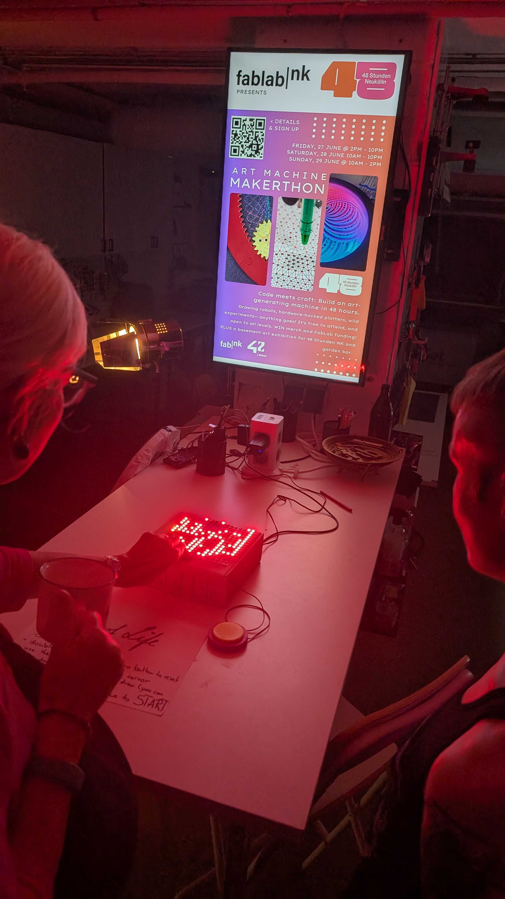

# Panel-of-Life

This is a Makerthon Project for the [FablabNK](https://github.com/fablabnk) Makerthon 2025.

This uses an LED Panel, an Arduino a joystick for movement and one external Button to draw on the Panel and start Game of Life from that state.

### Controls

- Press the external Button twice to reset (enters Drawing Mode)
- Use the joystick to move, press down on the joystick (and hold) to draw while moving
- Press the external Button once to start Game of Life from your Drawing!
- You may at any point press the external button once to continue drawing from the current state of Game of Life, or twice to reset it and start drawing on a blank slate again.

### Pictures

